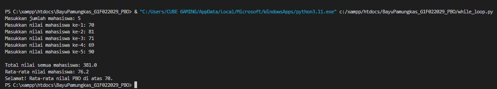

# _Tugas Pemrograman Berbasis Objek_

## 1. _Buatlah perulangan hingga 100 menggunakan Python_
program Python yang menggunakan perulangan while untuk mencetak angka dari 1 hingga 100. Ketika nilai angka adalah kelipatan 10, program mencetak nama "Bayu" tiga kali pada baris baru. Jika tidak, program mencetak nilai angka itu sendiri.

#### Luaran

1
2
3
4
5
6
7
8
9
Bayu 
Bayu 
Bayu
11
12
13
14
15
16
17
18
19
Bayu 
Bayu 
Bayu
21
22
23
24
25
26
27
28
29
Bayu 
Bayu 
Bayu
31
32
33
34
35
36
37
38
39
Bayu 
Bayu 
Bayu
41
42
43
44
45
46
47
48
49
Bayu 
Bayu 
Bayu
51
52
53
54
55
56
57
58
59
Bayu 
Bayu 
Bayu
61
62
63
64
65
66
67
68
69
Bayu 
Bayu 
Bayu
71
72
73
74
75
76
77
78
79
Bayu 
Bayu 
Bayu
81
82
83
84
85
86
87
88
89
Bayu 
Bayu 
Bayu
91
92
93
94
95
96
97
98
99
Bayu 
Bayu 
Bayu

Table 1. Penjelasan Tiap Section Code Dari No 1

| Code                        | Penjelasan                                                                                                                                                                                                                          |
| --------------------------- | ----------------------------------------------------------------------------------------------------------------------------------------------------------------------------------------------------------------------------------- |
| `b = 1`                     | Inisialisasi variabel `b` dengan nilai awal 1. Variabel ini akan digunakan untuk mengontrol perulangan `while`.                                                                                                                    |
| `while b <= 100:`           | Statement `while` yang akan menjalankan blok kode di dalamnya selama kondisi `b <= 100` benar (True). Dengan kata lain, perulangan akan berlanjut selama nilai `b` kurang dari atau sama dengan 100.                               |
| `  if b % 10 == 0:`         | Blok `if`. Jika nilai `b` merupakan kelipatan 10 (diperiksa menggunakan `b % 10 == 0`), maka program akan mencetak string "Bayu" tiga kali dengan menggunakan `\n` untuk mencetak baris baru setelah setiap "Bayu".               |
| `    print("Bayu \nBayu \nBayu")` |                                                                                                                                                                                                                                     |
| `  else:`                   |                                                                                                                                                                                                                                     |
| `    print(b)`              | Blok `else` yang terkait dengan blok `if`. Jika kondisi pada `if` tidak terpenuhi (nilai `b` bukan kelipatan 10), maka program akan mencetak nilai `b`.                                                                           |
| `b += 1`                    | Bagian yang menginkremen `b` dengan 1 setiap kali iterasi perulangan selesai. Hal ini penting untuk mencegah terjadinya perulangan tak terbatas (infinite loop) dan memastikan bahwa suatu saat kondisi `while` tidak terpenuhi sehingga perulangan berhenti. |

## 2. _ Buatlah program bebas, dengan menerapkan if else pada :_
### a. _For Loops_
For loops dalam Python digunakan untuk mengulangi (iterasi) suatu blok kode sejumlah tertentu kali atau melalui setiap elemen dalam suatu urutan (seperti daftar, tupel, atau string). Ini memungkinkan kita menjalankan serangkaian pernyataan untuk setiap elemen atau iterasi yang ada.

### Luaran

Table 2. Penjelasan Tiap Section Code For Loops

| Code                   | Penjelasan                                                                                                                                                        |
| ---------------------- | ------------------------------------------------------------------------------------------------------------------------------------------------------------------ |
| `range(1, 11, 2)`      | Membuat deret angka dari 1 hingga 10 (sepuluh angka) dengan langkah (step) sebesar 2. Ini menghasilkan deret angka ganjil dari 1 hingga 9.                             |
| `for i in range(1, 11, 2):` | Pernyataan `for` yang mengiterasi melalui setiap nilai dalam deret angka yang dihasilkan oleh `range(1, 11, 2)`.                                              |
| `    print(i)`          | Mencetak nilai `i` pada setiap iterasi.                                                                                                                           |

### b. _While Loops_
For loops dalam Python digunakan untuk mengulangi (iterasi) suatu blok kode sejumlah tertentu kali atau melalui setiap elemen dalam suatu urutan (seperti daftar, tupel, atau string). Ini memungkinkan kita menjalankan serangkaian pernyataan untuk setiap elemen atau iterasi yang ada.

#### Luaran
Output yang dihasilkan dari kode ini akan sama dengan output dari perulangan For sebelumnya, yaitu angka ganjil dari 1 hingga 9.

Table 3. Penjelasan Tiap Section Code While Loops

| Code                | Penjelasan                                                                                                                                                        |
| ------------------- | ------------------------------------------------------------------------------------------------------------------------------------------------------------------ |
| `i = 1`             | Inisialisasi variabel `i` dengan nilai awal 1. Variabel ini berfungsi sebagai penghitung atau penunjuk iterasi dalam perulangan.                                      |
| `n = 10`            | Variabel `n` diinisialisasi dengan nilai 10. Variabel ini menyimpan batas atas atau kondisi berhenti untuk perulangan. Perulangan akan berlanjut selama nilai `i` kurang dari atau sama dengan `n`.  |
| `while i <= n:`     | Pernyataan kontrol perulangan `while`. Pernyataan ini menjalankan blok kode di dalamnya selama kondisi `i <= n` bernilai benar (True).                                |
| `    print(i)`      | Setiap iterasi, nilai `i` dicetak. Pada awalnya, nilai `i` adalah 1.                                                                                                   |
| `    i = i + 2`     | Setelah mencetak nilai `i`, nilai `i` ditambah 2. Ini bertujuan agar perulangan hanya mencetak angka ganjil, karena nilai `i` akan selalu bertambah 2 pada setiap iterasi. |

## 3. _ Buatlah sebuah variabel dengan tipe data array, kemudian tampilkan semua nilai dalam variabel tersebut menggunakan perulangan for _

### Luaran

| Code                       | Penjelasan                                                                                      |
| -------------------------- | ----------------------------------------------------------------------------------------------- |
| `array = [10, 20, 30, 40, 50]` | Variabel yang berisi list dengan beberapa nilai.                                                |
| `for value in array:`      | Pernyataan `for` yang akan mengiterasi melalui setiap nilai dalam list `array`.                |
| `    print(value)`         | Mencetak nilai `value` pada setiap iterasi.                                                    |

